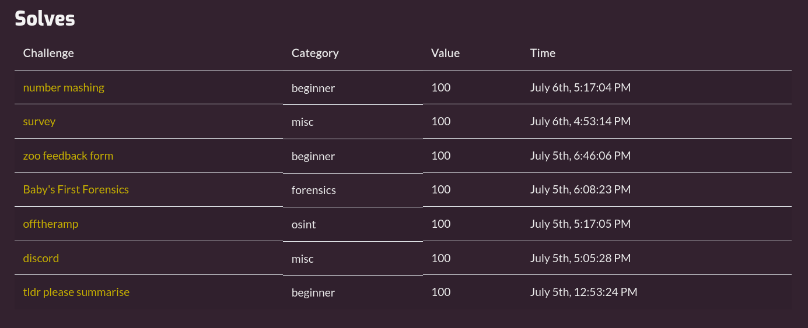

# DownUnderCTF 2024 Writeup

[DownUnderCTF 2024](https://downunderctf.com/) was a 48 hour competition that ran from 7/5/2024 to 7/7/2024. Below are my writeups for the challenges
I attempted, including the ones that I did not successfully complete. You can also view my results in the competition below my writeups.

Click [here](https://github.com/rstacks/ctf-writeups) to check out my writeups for other CTFs I've participated in.

## Solved Challenges

  
Forensics

  
  * [Baby's First Forensics](https://github.com/rstacks/DownUnderCTF2024-writeup/tree/master/forensics/BabysFirstForensics)

  
Misc

  * [tldr please summarise](https://github.com/rstacks/DownUnderCTF2024-writeup/tree/master/misc/tldr_please_summarise)
  

  
OSINT

  * [offtheramp](https://github.com/rstacks/DownUnderCTF2024-writeup/tree/master/osint/offtheramp)
  

  
Rev

  * [number mashing](https://github.com/rstacks/DownUnderCTF2024-writeup/tree/master/rev/number_mashing)

  
Web

  * [zoo feedback form](https://github.com/rstacks/DownUnderCTF2024-writeup/tree/master/web/zoo_feedback_form)
  

## Unfinished Challenges

  
Crypto

  * [Sun Zi's Perfect Math Class](https://github.com/rstacks/DownUnderCTF2024-writeup/tree/master/crypto/SunZisPerfectMathClass_UNFINISHED)
  * [shufflebox](https://github.com/rstacks/DownUnderCTF2024-writeup/tree/master/crypto/shufflebox_UNFINISHED)
  

## Results

I was the sole member of team Boy Wonder. I scored **700 points** in total and finished **737th out of 1515** teams (that solved at least one challenge).

*Writeups for the "discord" and "survey" challenges are not included.
