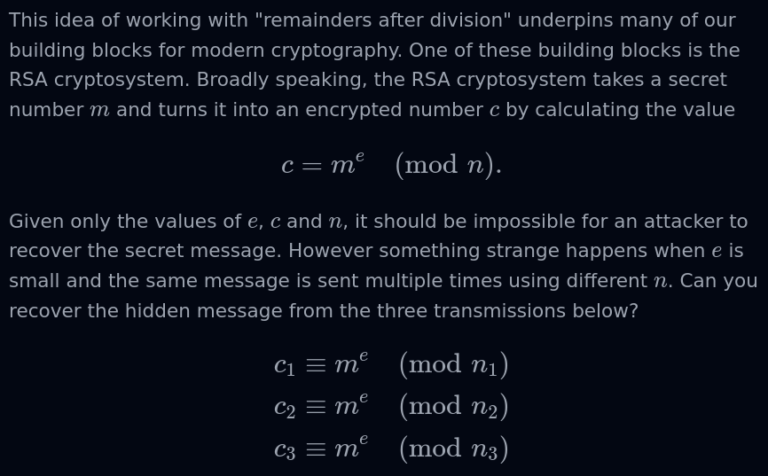
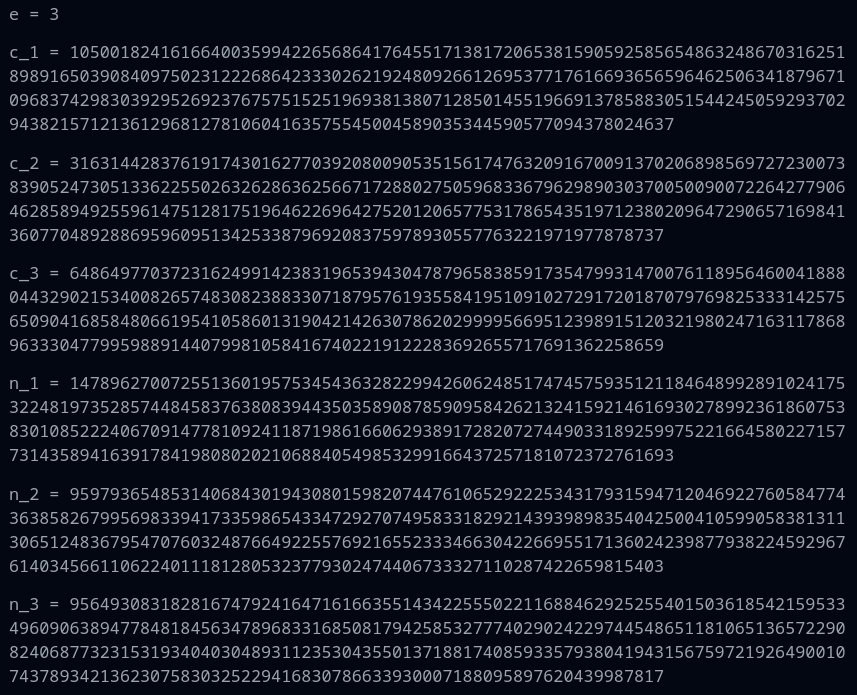

# Sun Zi's Perfect Math Class

## Description

Everybody!! Sunzi's math class is about to begin!!!

https://crypto-sunzi-perfect-math-class-6c3d583b3a73.2024.ductf.dev

## Solution (Unfinished)

- The provided webpage prompts us with the following problem:
```
When the soldiers stand 3 in a row, there are 2 soldiers left over.
When they line up 5 in a row, there are 4 soldiers left over.
When they line up 7 in a row, there are 5 soldiers left over.
```

- We are asked to determine the number of soldiers based on this information. We are told
that there are between 1000 and 1100 soldiers. I wrote a [Python script](https://github.com/rstacks/DownUnderCTF2024-writeup/blob/master/crypto/SunZisPerfectMathClass_UNFINISHED/math_class.py) that went through every
number in this range and printed out the number that satisfied the three conditions above. This number
was **1034**.
- Entering 1034 into the website revealed an additional problem to solve:




- I wasn't immediately sure how to proceed, so I moved on to a different challenge.
