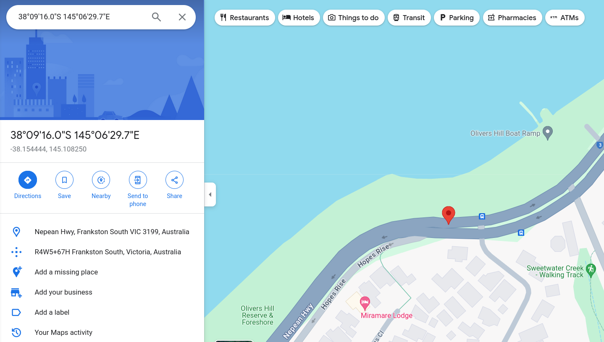

# offtheramp

## Description

That looks like a pretty cool place to escape by boat,
EXAMINE the image and discover the name of this structure.

NOTE: Flag is case-insensitive and requires placing inside <code>DUCTF{}</code>! 
e.g <code>DUCTF{name_of_structure}</code>

## Attachments

[offtheramp.jpeg](https://github.com/rstacks/DownUnderCTF2024-writeup/blob/master/osint/offtheramp/attachments/offtheramp.jpeg)

## Solution

- I took the hint from the challenge description and used <code>exiftool</code> to examine the provided
image's [metadata](https://github.com/rstacks/DownUnderCTF2024-writeup/blob/master/osint/offtheramp/metadata.txt).
- Of particular note were the last few lines, which seemed to be the coordinates
at which this photo was taken. I entered the coordinates into [Google Maps](https://www.google.com/maps), which brought me
to a location in Melbourne:

- A nearby location of note was Olivers Hill Boat Ramp, which was indeed the flag.

## Flag

DUCTF{Olivers Hill Boat Ramp}
